# Sanlight Wifi dimmer
Sanlight itself only offers a BT dimmer with a proprietary app to control. But since I received the requirement to integrate this lamp into a smart home, I decided to dig into this and share it.  
This is about the Q series of the lamps. Recently I gotten hold of one of theight BT dimmers, and since the lamp itself offer a 3 pin connector (to my knowledge it's called Wieland Plug) for the dimmer module, it was quite easy to measure the voltages on the pins.  
We have +12V, GND and a analog input which is driven by 0-10V. At least this I could determine by measuring the dimmers behaviour. After reading lots on the net, it turned out that this concept seems to be a common concept for the most dimmable grow lights.  
Here's the pinout  
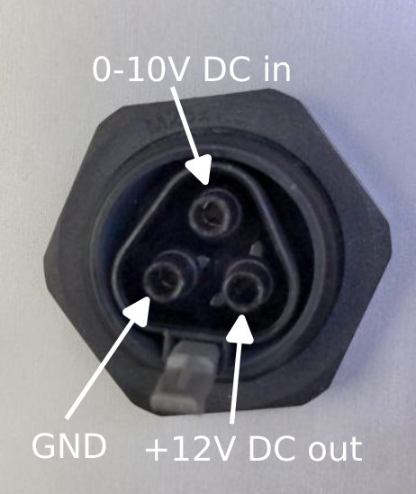

# Bill of materials
## Wemos D1 mini  
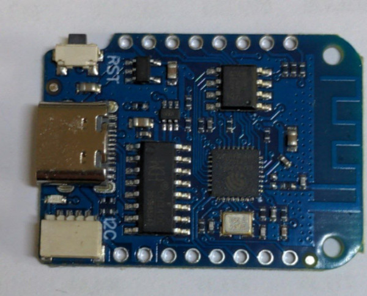  
## Buck converter 12Vdc -> 5Vdc  
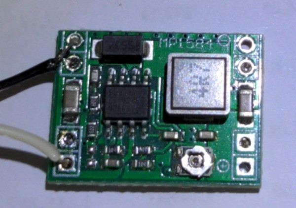 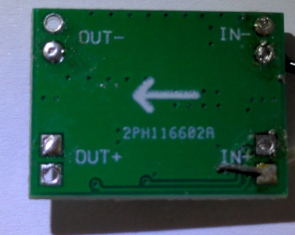 
## PWM converter 0-10Vdc
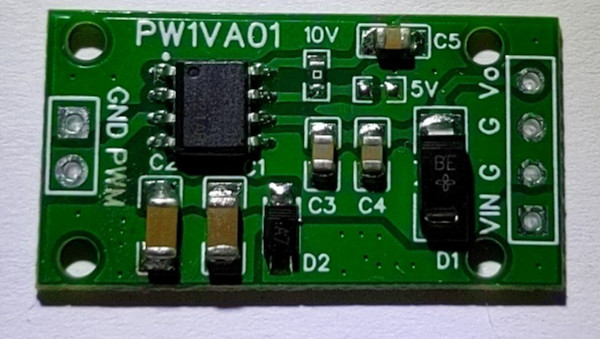 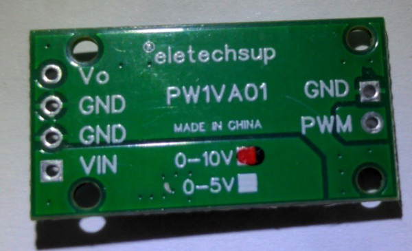 
## Wieland plug
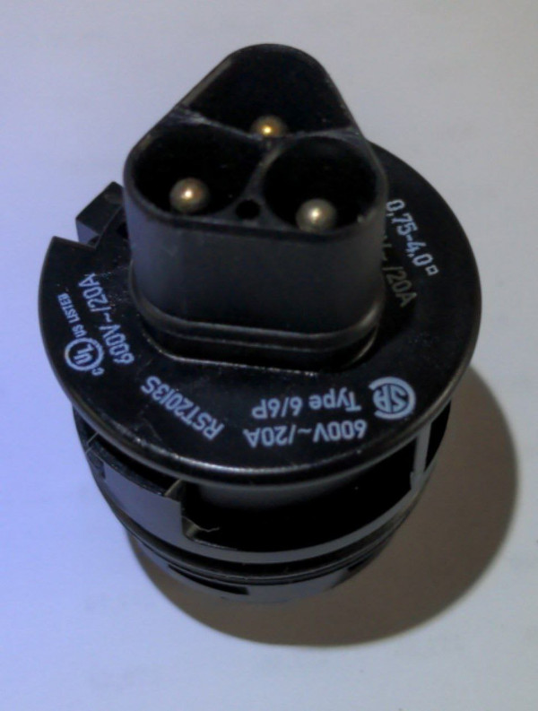 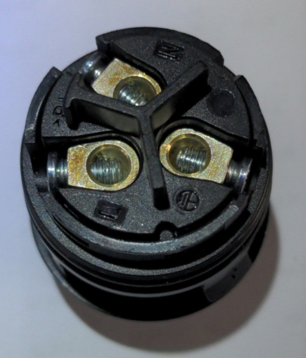 

# Case
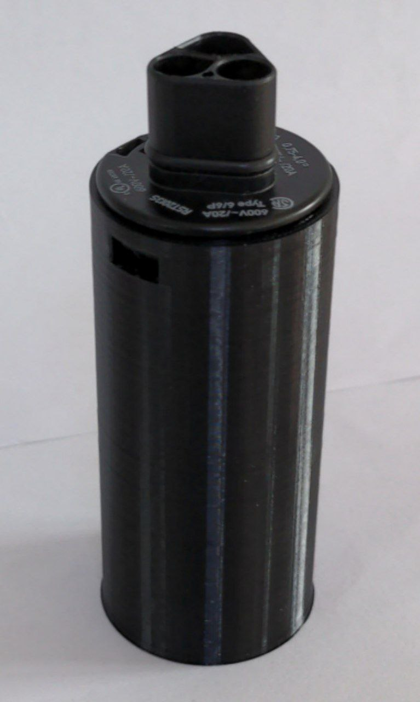

# Wiring
The basic wiring should be obvious and the PWM input of the PWM converter should be soldered to D1 of the Wemos D1.

# Tasmota
After connecting everything you should upload Tasmota to the Wemos D1 and set it up accordingly.

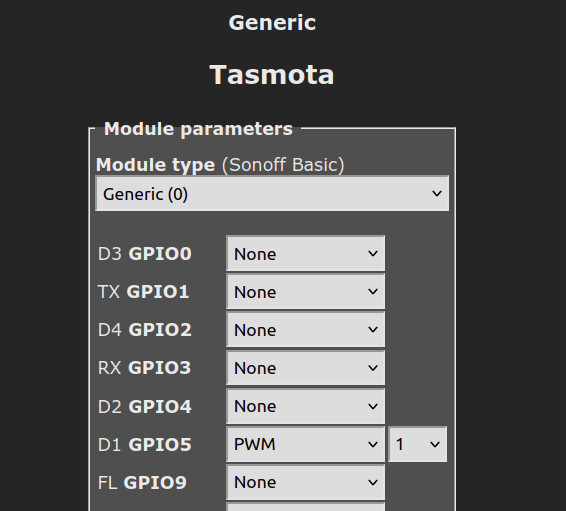 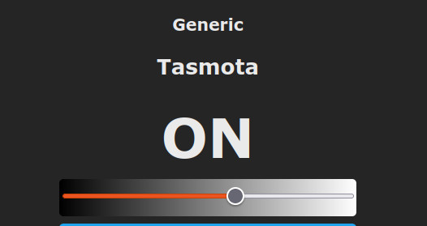  

Now this is ready to be integrated into the smart home of your choice. 

**Do not use a propriatery smart home if you value freedom of knowledge.**
